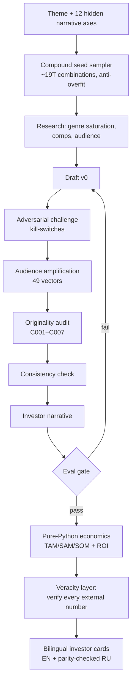

<div align="center">

# story-ideation-os

**A multi-agent operating system that generates investor-grade film & series concepts — where every financial number is computed in Python, and every external claim is verified against a primary source.**

[](LICENSE)
[](pyproject.toml)
[](#quality--verification)
[](#quality--verification)
[](docs/adr)
[](https://claude.com/claude-code)

[Showcase: 20-concept slate ↓](#-showcase-a-20-concept-bilingual-slate) · [How it works ↓](#how-does-it-work) · [Quickstart ↓](#quickstart) · [Architecture →](docs/REPOSITORY_STRUCTURE.md)

</div>

---

story-ideation-os turns a single theme into a complete, investor-ready film or series concept: logline, market sizing, audience model, comparable-title economics, risk register, and a bilingual pitch — with anti-hallucination guarantees baked into the architecture. Large language models draft the prose; pure Python computes every score and revenue figure; an evidence layer verifies every external number against a real source URL.

## Why does this exist?

Most "AI idea generators" hallucinate confidently: invented box-office numbers, made-up market sizes, plausible-but-fake comparable films. That is fatal for anything an investor will read. story-ideation-os is built on the opposite premise — **the model is never trusted with a number.** It is an end-to-end system that pairs a 19-trillion-combination creative engine with a deterministic scoring core and a source-verification layer, so the output is both original *and* defensible.

| Without guardrails | story-ideation-os |
|---|---|
| LLM writes the revenue figure | Revenue is `python_executed`; the LLM is structurally forbidden from writing scores (ADR-0002) |
| "Comparable films" are invented | Comps are matched against an ~890-title corpus with real worldwide grosses and ROI |
| Market sizes sound right | Every external number is probed against a primary-source URL and quoted verbatim, or marked unverified |
| State lives in a chat window | All cross-step state is written to disk atomically and resumes after a crash (ADR-0001) |
| One prompt, one shot | Recursive challenge / amplify / genius / consistency loops with plateau detection (ADR-0009) |

## What's inside?

- **A combinatorial creative engine.** Concepts are sampled from a seed space of **~19 trillion combinations across 12 narrative axes** (psychological wounds, structural inversions, era collisions, world textures, moral fault-lines, and more), with anti-overfit sampling so no single motif can dominate a run (ADR-0012).
- **Pure-Python economics.** Market sizing (TAM → SAM → SOM), revenue projection, and ROI are computed by code anchored to an **~890-film comparable corpus** — never written by a language model (ADR-0002, ADR-0011).
- **An evidence & veracity layer.** A multi-gateway research router fetches sources, and a verifier confirms each claimed number actually appears on the cited page, captures a ≤25-word quote, and classifies support / contradiction / silence.
- **A 12-stage agent pipeline.** seed → research → draft → adversarial challenge → audience amplification (**49 vectors**) → originality audit → consistency check → investor narrative → eval gate → lessons.
- **Bilingual output.** English and a parity-checked Russian translation, with `$`-figures and URLs frozen byte-for-byte across languages.
- **A governance harness.** The operating contract (`CLAUDE.md`) encodes every hard rule as a MUST/MUST-NOT line tied to a mechanical enforcer — **12 Architecture Decision Records**, an import linter, and pre-commit/CI gates.

## ⭐ Showcase: a 20-concept bilingual slate

The [`showcase/`](showcase/) directory contains a complete flagship slate produced by the engine — **20 original concepts, in English and Russian**, each with verified comparable-title economics and inline deep-links to primary sources.

- 📂 [`showcase/concepts/EN/`](showcase/concepts/EN) — 20 English concept cards
- 📂 [`showcase/concepts/RU/`](showcase/concepts/RU) — 20 Russian translations (parity-checked)
- 📄 [`showcase/SLATE_SUMMARY.md`](showcase/SLATE_SUMMARY.md) — slate-wide metrics
- 📄 [`showcase/BEST_IDEAS_VERIFIED.md`](showcase/BEST_IDEAS_VERIFIED.md) — the headline picks

> Each card states its Year-1 SOM as a `python_executed`, comp-anchored figure with an explicit methodology block and an 80% confidence band — the kind of number an analyst can audit, not a number a model guessed.

## How does it work?



The engine is organized into **eight layers** — state durability, dispatch & quota, generation, scoring & gates, economics, evidence & veracity, selection & feedback, and rendering. The full map, with the responsibility and key files of each layer, is in **[docs/REPOSITORY_STRUCTURE.md](docs/REPOSITORY_STRUCTURE.md)**.

## What makes the numbers trustworthy?

Every guarantee below is an *architectural* property with a named enforcer — not a marketing claim:

| Guarantee | How it is enforced |
|---|---|
| LLMs never compute financial figures | All scoring is in `pipeline/scoring.py`; an import linter (`ANOMALY-001`) forbids any LLM client there, and the schema rejects an LLM-supplied `total_score` (ADR-0002) |
| Revenue is reproducible | `som_y1_usd` comes from `pipeline.crystallize.revenue`; outputs carry `calculation_method: python_executed` (ADR-0011) |
| No internal jargon leaks to investors | A template filter strips framework labels and internal IDs before any investor file is written (ADR-0010) |
| Runs survive a crash | State is written with atomic `tmp + fsync + rename`; a kill-9 recovery path is tested end-to-end (ADR-0001) |
| Budget can't run away | Model dispatch is quota-gated and fails closed when the cap is hit (ADR-0008) |

The complete reasoning behind each rule lives in the **[Architecture Decision Records](docs/adr)**.

## Quickstart

> The **offline** layers — generation, scoring, schema validation, corpus matching, and the full test suite — run with **no API keys**. Keys are only needed for the live research and model-dispatch layers.

```bash
# 1. Clone
git clone https://github.com/avaluev/story-ideation-os.git
cd story-ideation-os

# 2. Install (uv — https://docs.astral.sh/uv/)
uv sync

# 3. Verify a green baseline (offline, no keys)
make test        # unit + contract tests
make eval        # behavioral eval gates
make lint        # import rules (ANOMALY-001..003)

# 4. (Optional) configure keys for the live pipeline
cp .env.example .env   # then replace every REPLACE-ME
```

Explore the engine with the in-repo tools:

```bash
uv run python -m pipeline.crystallize --help   # batch ideation over the seed space
uv run python -m pipeline.veracity --help      # the claim-verification layer
```

## Repository structure

| Path | What it is |
|---|---|
| [`pipeline/`](pipeline) | The engine — 8 layers, ~33k lines of Python |
| [`frameworks/`](frameworks) | Read-only creative doctrine (story structure, archetypes, conflict theory) |
| [`showcase/`](showcase) | The 20-concept bilingual flagship slate |
| [`docs/`](docs) | Architecture, the 12 ADRs, C4 model, schema, structure map |
| [`tests/`](tests) · [`evals/`](evals) | 2,100+ tests · 110+ eval gates |
| [`.claude/`](.claude) | The multi-agent harness: 15 agents, hooks, skills, workflows |
| [`scripts/`](scripts) | Operator & maintenance CLIs |
| [`CLAUDE.md`](CLAUDE.md) | The operating contract — every rule has a mechanical enforcer |

Full details: **[docs/REPOSITORY_STRUCTURE.md](docs/REPOSITORY_STRUCTURE.md)**.

## Quality & verification

This project is built test-first and treats its own claims with the same skepticism it applies to generated concepts:

- **2,100+ unit & contract tests** (`make test`) — many double as enforcers of the rules in `CLAUDE.md`.
- **110+ behavioral eval gates** (`make eval`) — content quality, citation coverage, no-internal-ID, math integrity.
- **An import linter** (`make lint`, `ANOMALY-001..003`) — keeps LLM clients out of the scoring core and prevents dead code.
- **Pre-commit & CI gates** — `ruff`, `pyright`, and `gitleaks` on every change; tests and evals on push.
- **12 Architecture Decision Records** documenting every load-bearing invariant.

## Status & roadmap

story-ideation-os is a working research engine, released as a faithful, secret-free open-source mirror. The offline pipeline (generation, scoring, economics, frameworks) runs out of the box; the live research/dispatch layers require API keys. Known backlog items (file-size refactors, expanded runtime enforcement of sampling ceilings, documentation reconciliation) are tracked in the issues and noted inline in the docs.

## Contributing

Contributions are welcome — see [CONTRIBUTING.md](CONTRIBUTING.md). The golden rule mirrors the engine's own: **numbers come from Python, claims come from sources.** Run `make test && make eval && make lint` before opening a pull request.

## Acknowledgements

Built with [Claude Code](https://claude.com/claude-code). Comparable-title and market data derive from public sources credited in [NOTICE](NOTICE) (TMDB, Box Office Mojo / The Numbers, the MPA THEME Report). The creative frameworks referenced in [`frameworks/`](frameworks) are credited to their original authors.

## License

[Apache License 2.0](LICENSE) © 2026 Alexander Valuev.
