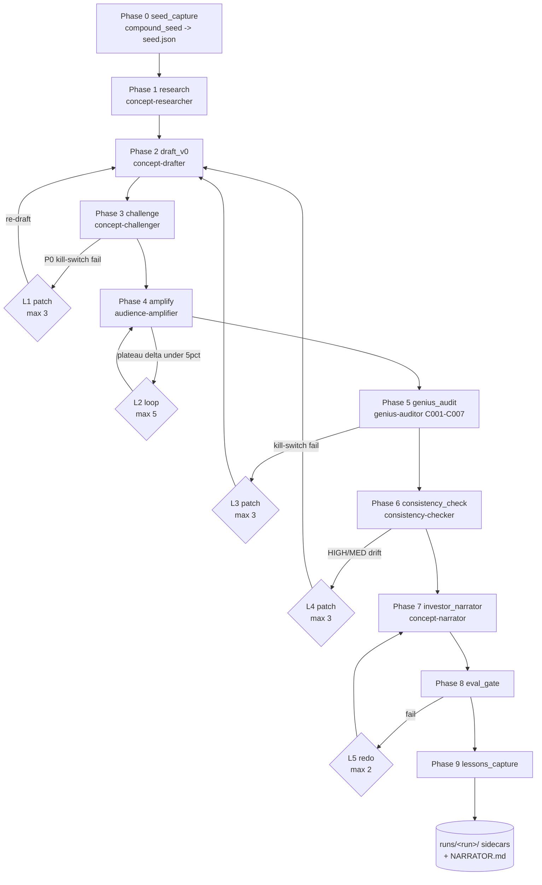
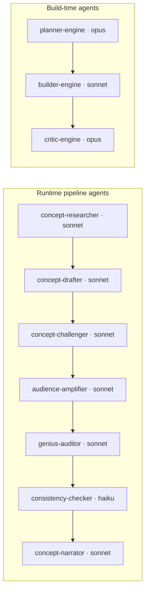
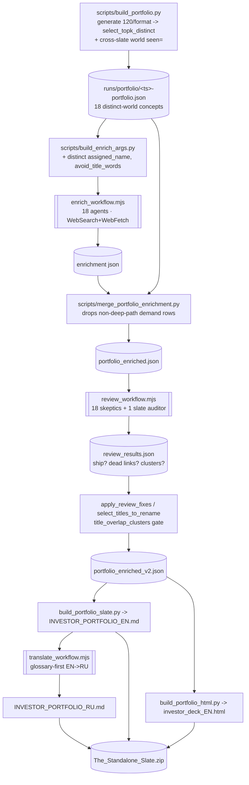
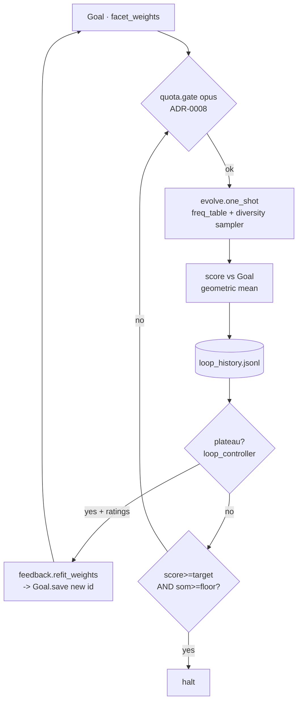
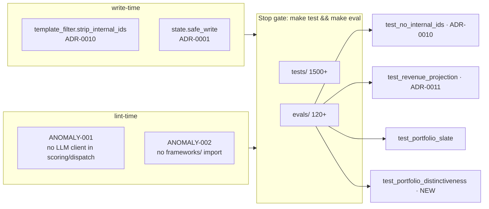
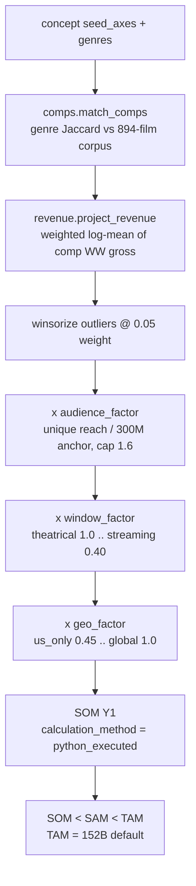

# Anomaly Engine v5.2 — Solution Architecture

> Engineering reference for the Anomaly Engine: a film/TV concept-generation
> system that turns a problem + themes into investor-grade, evidence-backed
> screen-property concepts and diversified portfolios — with every financial
> number computed in Python (never by a language model) and every demand claim
> traced to a deep-link source that returns 2xx.
>
> This document names internal frameworks and ADRs deliberately; it lives under
> `docs/` (engineering-facing) and is exempt from the investor-facing
> internal-ID strip (ADR-0010) that governs `runs/` output. Last updated
> 2026-05-29 (v5.2 P5 — adversarial-review pass + cross-slate distinctness).
>
> **See also** the navigable **C4 architecture vault** (Obsidian-flavoured, with
> System-Context → Container → Component → Code diagrams) at
> [`docs/architecture/`](architecture/_index.md).

---

## 1. System overview

The engine has **two production tracks** over one shared substrate:

| Track | Entry | Output | When |
|---|---|---|---|
| **Single-Idea Pipeline** | `pipeline/run_single_idea.py` (skill `single-idea`) | one fully-developed concept (`runs/<run>/[slug]-NARRATOR.md` + sidecars) | deep development of one idea |
| **Portfolio Track** | `scripts/build_portfolio.py` + workflows | a diversified N-concept investor slate (`outputs/portfolio/`) | a greenlightable slate across formats |
| **Autonomous loop (WEDGE)** | `pipeline/loop_wedge.py` (skill `loop-engine`) | batch ideation against a learned `Goal` | unattended exploration |

The shared substrate is a **894-film corpus** (`pipeline/crystallize/corpus.py`)
that anchors every revenue projection to real box-office comparables, a
**compound-seed engine** (`pipeline/compound_seed.py`) that samples one of
~19.2 trillion narrative-axis combinations, and a **pure-Python scoring layer**
(`pipeline/scoring.py`, `pipeline/crystallize/*`) that the anti-hallucination
ADRs forbid any LLM from touching.

### Core invariants (the ADRs, in one breath)

- **State lives on disk** as JSONL, written atomically — never in agent context (ADR-0001).
- **LLMs do no arithmetic.** Every score/SOM is python-executed (ADR-0002, ADR-0011).
- **Frameworks are read-only**; no `pipeline/**` module imports `frameworks/` (ADR-0005).
- **Investor output carries no internal IDs** or framework labels (ADR-0010).
- **Every demand claim is a deep-link** that resolves (deep-link evidence policy).

---

## 2. Architecture diagrams

### 2.1 Single-Idea Pipeline (10 phases + L1–L5 patch loops)



Loop budgets are enforced in pure Python (`pipeline/loop_controller.py`,
ADR-0009): `L1=3, L2=5, L3=3, L4=3, L5=2`. Plateau = the last `window=2`
relative deltas all `< 0.05` (strictly less). No LLM decides when a loop stops.

### 2.2 Agent roster + model tiers



### 2.3 Portfolio track data-flow (this delivery)



### 2.4 WEDGE autonomous closed loop



### 2.5 ADR / quality-gate enforcement map



### 2.6 Revenue / comps substrate (ADR-0011)



---

## 3. Agents (per-agent reference)

| Agent | Model | Phase | Reads | Writes | Role |
|---|---|---|---|---|---|
| `concept-researcher` | sonnet | 1 research | `seed.json` | `research.json`, `[slug]-RESEARCH.md` | Genre saturation, cultural-moment verification, audience sizing (live search). |
| `concept-drafter` | sonnet | 2 draft + L1/L3/L4 patches | `seed.json`, `research.json`, failure sidecars | `draft_v0.json`, `[slug].md` | Template-compliant concept draft; surgical patches on retry. Never exposes framework labels. |
| `concept-challenger` | sonnet | 3 challenge | `draft_v0.json` | `challenge.json`, `[slug]-CHALLENGE.md` | Adversarial kill-switch interrogation; one P0 fail = REJECT. |
| `audience-amplifier` | sonnet | 4 amplify | `draft_v0.json`, `research.json` | `amplification.json`, `[slug]-AMPLIFIED.md` | Compound multiplier across distribution/community/IP vectors; produces TAM/SAM/SOM trail. |
| `genius-auditor` | sonnet | 5 genius_audit | draft + challenge + amplification | `genius.json` | 7 originality kill-switches (C001–C007); any fail → L3. |
| `consistency-checker` | haiku | 6 consistency | all prior sidecars | `consistency.json` | Cross-sidecar drift (title/logline/SOM/conditions); HIGH/MED → L4. |
| `concept-narrator` | sonnet | 7 narrator | draft + challenge + research + amplified | `[slug]-NARRATOR.md` | Investor companion: Investment Summary Card, plain-English story, honest risk, live TAM. |
| `planner-engine` | opus | build-time | PROJECT/ROADMAP/RESEARCH | `PLAN.md` | Emits per-phase task plans for the harness build (distinct from runtime). |
| `builder-engine` | sonnet | build-time | one `PLAN.md` | code + atomic commits | Executes plan tasks, runs lint/typecheck/test per task. |
| `critic-engine` | opus | build-time | diffs | review verdict | Adversarial review of builder output against ADRs / quality gates. |

**Portfolio-track agents** are workflow-spawned `general-purpose` agents (WebSearch + WebFetch + structured output), not `.claude/agents/` definitions:

| Workflow | Fan-out | Role |
|---|---|---|
| `enrich_workflow.mjs` | 1 agent/concept | Bespoke title + prose + 3–5 self-verified deep-link demand sources; honors engine DNA; uses the pre-assigned distinct protagonist name. |
| `review_workflow.mjs` | 18 skeptics + 1 slate auditor | Re-fetch every demand link; audit craft (jargon/IDs/logline/fabrication); cross-slate duplicate detection. |
| `translate_workflow.mjs` | 1 glossary builder + 1 agent/card | Glossary-first EN→RU, URLs preserved byte-identical. |

---

## 4. Modules (per-module reference)

### `pipeline/` (orchestration + LLM-free logic)

| Module | Role | ADR |
|---|---|---|
| `run_single_idea.py` / `single_idea.py` | 10-phase orchestrator + phase→agent/model map | 0007 |
| `state.py` | `safe_write` (atomic tmp+fsync+rename), JSONL append, handoff/checkpoint | 0001 |
| `scoring.py` | SDT + AJTBD + overall score (pure Python; the only arithmetic) | 0002, 0005 |
| `loop_controller.py` | `plateau_reached`, `patch_budget` (L1–L5 caps) | 0009 |
| `loop_wedge.py` | autonomous batch loop: generate → score → plateau → refit → halt | 0009, 0012 |
| `diversity.py` | axis-value frequency table + soft penalty (anti-overfit, α=0.8) | 0012 |
| `cc_dispatch.py` / `gemini_dispatch.py` | pure-Python Task fan-out manifests (no LLM client import) | 0007, 0008 |
| `quota.py` | weekly subscription burn gate for Opus promotion | 0008 |
| `template_filter.py` | `strip_internal_ids`, `scan_for_internal_ids`, translation-friendliness, SOM-line canon | 0010 |
| `consistency.py` | `detect_drift` across sidecars | — |
| `research_dispatch.py` / `sonar_cache.py` | pre-fetch + cache live research evidence | 0001 |
| `goal.py` / `feedback.py` / `labels.py` | learned `Goal` weights, operator-rating refit | 0012 |
| `leaderboard.py` | cross-run leaderboard + mode-collapse alarm | 0001, 0002 |
| `empirical_genius.py` | embedding-novelty + originality scoring (pre-computed for the auditor) | 0002 |
| `compound_seed.py` / `seed_engine.py` / `seed_moa.py` | narrative-axis seed generation | — |

### `pipeline/crystallize/` (corpus, economics, portfolio)

| Module | Role | ADR |
|---|---|---|
| `corpus.py` | 894-film `Film` dataclass loader + genre alias map | 0005 |
| `comps.py` | genre-Jaccard comp matching against the corpus | — |
| `revenue.py` | corpus-anchored SOM/SAM/TAM (`project_revenue`, `calculation_method="python_executed"`) | 0011 |
| `embeddings.py` | 894-film cosine index for novelty | — |
| `portfolio.py` | `select_topk_distinct` (now cross-slate `seen=`), `assign_distinct_comps`, `is_deep_path`, `validate_demand_evidence`, `title_overlap_clusters`, `select_titles_to_rename`, `apply_review_fixes` | 0005 |
| `format_economics.py` | per-format cost/revenue profiles | 0002 |
| `score.py` / `greatness.py` | crystallization score, empirical greatness rubric | 0002 |
| `board.py` / `cluster.py` / `html_export.py` | crystal-board sidecar, clustering, leaderboard HTML | 0001 |

---

## 5. ADR registry

| ADR | Title | Mechanical enforcer |
|---|---|---|
| 0001 | State on disk as JSONL, not agent memory | `tests/test_state.py::test_atomic_write_under_kill` |
| 0002 | LLMs do no arithmetic | ANOMALY-001 lint + `tests/test_scoring.py` |
| 0003 | 3-key rotation + secret masking | `tests/test_log_masking.py`, `tests/test_secret_leak.py` |
| 0004 | Canonical data immutable downstream | `tests/test_audit_concepts.py` |
| 0005 | `frameworks/` read-only | ANOMALY-002 (`scripts/lint_imports.py`) |
| 0006 | Opus promotion (superseded by 0008) | — |
| 0007 | Pure-CC Task dispatch replaces OpenRouter | `tests/test_cc_dispatch.py` |
| 0008 | Opus promotion gated by weekly quota | `tests/test_quota.py` |
| 0009 | Single-idea recursive loops L1–L5 | `tests/test_loop_controller.py` |
| 0010 | No internal IDs in investor docs | `evals/test_no_internal_ids.py` |
| 0011 | Data-driven revenue | `evals/test_revenue_projection.py` |
| 0012 | Anti-overfit sampling (≤40% per axis-value / 20 runs) | `tests/test_anti_overfit_ceiling.py` |

---

## 6. Quality harness

- **Stop gate:** `make test && make eval` must both pass before any session is declared done (Stop hook blocks on a stale `RESUME.md`).
- **Tests** (`tests/`, ~1500+): state durability, scoring, secrets, dispatch, quota, loop control, anti-overfit, template filter, portfolio selection/dedup, CLAUDE.md compliance, hooks.
- **Evals** (`evals/`, ~120+): format compliance, research/challenge verification, revenue calibration (leave-one-out MdAPE ≤ 50%, σ ≥ 0.08, Spearman ρ ≥ 0.30, `calculation_method` set), SOM credibility bounds, translation-friendliness (FK ≤ 13.5), anti-slop, deep-link evidence, `test_portfolio_slate`.
- **New this delivery — `evals/test_portfolio_distinctiveness.py`:** cross-slate title distinctiveness (no salient token shared across titles), logline distinctiveness (content-word Jaccard ≤ 0.50), and comp depth + deep-link audit (≥3 comps each with an IMDB/BOM deep link). Plus the cross-slate `seen=` distinctness in `select_topk_distinct` that guarantees N distinct worlds at generation time.

---

## 7. Anti-hallucination enforcement

1. **Python-executed economics (ADR-0011).** SOM/SAM/TAM come only from `revenue.project_revenue`; the `calculation_method` literal must equal `"python_executed"`. LLMs may never restate a financial number in prose.
2. **Deep-link evidence policy.** Every demand claim cites a deep-path HTTPS URL (no homepages, no search engines, no bare domains) confirmed reachable by WebFetch; `portfolio.validate_demand_evidence` drops any row that fails, and `is_deep_path` gates rendering.
3. **Adversarial review (P5).** A hostile-skeptic agent re-fetches every link and flags fabricated awards/stats, mis-scoped figures, jargon leaks, and over-long loglines; a cross-slate auditor flags duplicate premises. Findings are persisted to `review_results.json` and fixed before ship.
4. **Internal-ID strip (ADR-0010).** `strip_internal_ids` runs before any `runs/` write; `evals/test_no_internal_ids.py` blocks framework labels (TRIZ, JTBD, McKee, …) in investor output.

---

## 8. Prior delivery vs this delivery

| Dimension | Prior pack | This delivery (v5.2 P5) |
|---|---|---|
| Concepts | 1 | 18 across 6 formats |
| Distinct worlds | n/a | 18 / 18 (cross-slate `seen=` guarantee) |
| Premise duplication | n/a | 0 seed-level clusters (was 3 world-collisions, fixed) |
| Protagonist names | n/a | 18 distinct (was 14/18 "Mara/Maren/Maya") |
| Economics | prose | python-executed SOM/SAM/TAM, $5.48B combined Y1 floor |
| Demand proof | none | deep-linked sources, WebFetch-verified, adversarially re-checked |
| Adversarial review | none | 19-agent review + closed-loop re-verify |
| Distinctiveness gate | none | mechanical eval (titles + loglines + comps) |
| Languages | EN + machine RU | EN + glossary-first professional RU (URL-parity verified) |
| Architecture doc | none | this document |
```
