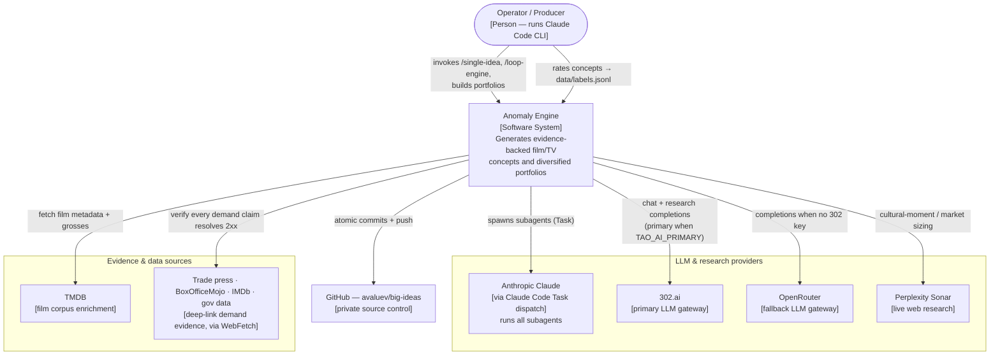

# C1 — System Context

> [!abstract] Level 1 answers one question
> *What does the Anomaly Engine do, who uses it, and what external systems does it
> depend on or serve?* No internal structure appears at this level — see
> [[02-c2-containers]] to zoom in.

## Context diagram

## Actors

> [!info] Who and what touches the engine
| Actor | Type | Interaction |
|---|---|---|
| **Operator / Producer** | Person | Runs the CLI skills, picks themes, **rates concepts** (the rating worksheet feeds [[05-adr-registry\|ADR-0012]] weight refit), decides pushes & key rotation. |
| **Anthropic Claude** | External system | Hosts every subagent. The engine routes all model calls through Claude Code **Task dispatch** (`pipeline/cc_dispatch.py`). |
| **302.ai** | External system | Primary LLM gateway when `TAO_AI_PRIMARY=1` or no OpenRouter key. Reaches `perplexity/sonar-pro` for research. |
| **OpenRouter** | External system | Fallback LLM gateway (free tier 50 calls/day, paid 1000/day). |
| **Perplexity Sonar** | External system | Live research (genre saturation, cultural moment, audience sizing) — reached *via* 302.ai or OpenRouter, cached 24h. |
| **TMDB** | External system | Source for the 894-film corpus enrichment (genres, grosses, prose). |
| **Demand-evidence web** | External sources | Trade press, BoxOfficeMojo, IMDb, government datasets — every numeric demand claim cites a **deep-path** URL that WebFetch confirms returns 2xx. |
| **GitHub** | External system | `avaluev/big-ideas` (private). All state + provenance committed. |

## What the engine guarantees to the outside world

> [!important] The promises that define the system
> 1. **No invented numbers.** SOM / SAM / TAM and all scores come from executed
>    Python ([[05-adr-registry|ADR-0002]], [[05-adr-registry|ADR-0011]]).
> 2. **No invented evidence.** Every demand claim is a reachable deep link; bare
>    domains, homepages and search-engine URLs are rejected.
> 3. **No internal leakage.** Investor-facing output carries no run-IDs or framework
>    labels ([[05-adr-registry|ADR-0010]]).
> 4. **Reproducibility.** Every cross-boundary fact is persisted to disk; a session
>    can be resumed from `.planning/state/RESUME.md`.

## Out of scope at C1

- How the engine is decomposed into runnable units → [[02-c2-containers]]
- Which Python modules implement each capability → [[03-c3-components]]

## Related
- [[_index|Architecture MOC]] · [[02-c2-containers]] · [[05-adr-registry]]
