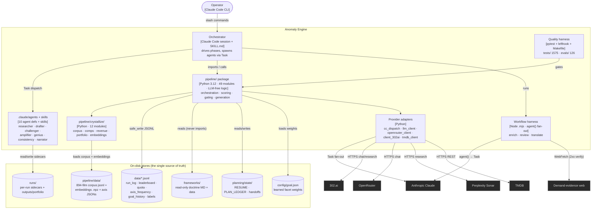

# C2 — Container Diagram

> [!abstract] Level 2 answers
> *What are the runtime units and data stores inside the Anomaly Engine, and how do
> they communicate?* This system has no servers — its "containers" are the
> **CLI orchestrator process**, the **Python engine package**, the **Node Workflow
> harness**, the **provider adapters**, and the **on-disk stores**.

## Container diagram

## Containers

> [!info] Each box is a unit that runs or stores
| Container | Tech | Responsibility |
|---|---|---|
| **Orchestrator** | Claude Code session + `SKILL.md` | One pipeline **stage per session** (HARN-13). Drives the 10-phase single-idea flow / WEDGE loop / portfolio build; spawns subagents read-only for fan-out. |
| **Agents** | `.claude/agents/` (10) + skills | Runtime: researcher → drafter → challenger → amplifier → genius → consistency → narrator. Build-time: planner → builder → critic. See [[03-c3-components]] and [[05-adr-registry\|model tiers]]. |
| **`pipeline/` package** | Python 3.12, 49 modules | All **LLM-free** logic: orchestration, scoring, dispatch, gating, generation, state, rendering. The only place arithmetic happens. |
| **`pipeline/crystallize/`** | Python, 12 modules | The **economics + corpus + portfolio** substrate: comp matching, revenue projection, distinct selection. |
| **Workflow harness** | Node `.mjs` via the Workflow tool | Parallel `agent()` fan-out for portfolio **enrich / review / translate** (1 agent per concept; WebSearch + WebFetch). |
| **Provider adapters** | Python | `cc_dispatch` (Claude Task), `llm_client` (factory), `openrouter_client`, `research/client_302ai`, `tmdb_client`. **No LLM client may be imported by scoring/dispatch** (ANOMALY-001). |
| **Quality harness** | pytest + lefthook + Makefile | The **Stop gate**: `make test` (1575) + `make eval` (126). Pre-commit: ruff/pyright/gitleaks. Pre-push: full suite. |

## Data stores

> [!important] State durability ([[05-adr-registry|ADR-0001]])
> Every cross-boundary fact is written to disk with `pipeline.state.safe_write`
> (atomic tmp + fsync + rename). Nothing load-bearing lives only in agent context.

| Store | Contents |
|---|---|
| `data/*.jsonl` | `run_log`, `leaderboard`, `quota`, `axis_frequency` (anti-overfit), `goal_history`, `labels`, `cell_history`, `01_assets`…`05_critiques` phase outputs. |
| `runs/` | Per-run pipeline sidecars (`seed`, `research`, `draft_v0`, `challenge`, `amplification`, `genius`, `consistency`, `eval`, `lessons`) + `outputs/portfolio/` deliverables. |
| `.planning/state/` | `RESUME.md` (recovery), `PLAN_LEDGER.jsonl`, `STATE.md`, agent handoff contracts. |
| `pipeline/data/` | 894-film corpus (`films_corpus_enriched.jsonl`), `films_corpus_embeddings.npz` (894×384), compound-seed axis JSONs. |
| `frameworks/` | Read-only narrative doctrine (SDT spine, AJTBD, McKee/Polti grids) — never imported (ANOMALY-002). |
| `config/goal.json` | Learned `Goal` facet weights (refit from operator ratings). |

## Out of scope at C2

- The modules inside `pipeline/` / `crystallize/` → [[03-c3-components]]
- How a concept flows phase-by-phase → [[04-c4-code-paths]]

## Related
- [[_index|Architecture MOC]] · [[01-c1-system-context]] · [[03-c3-components]] · [[05-adr-registry]]
