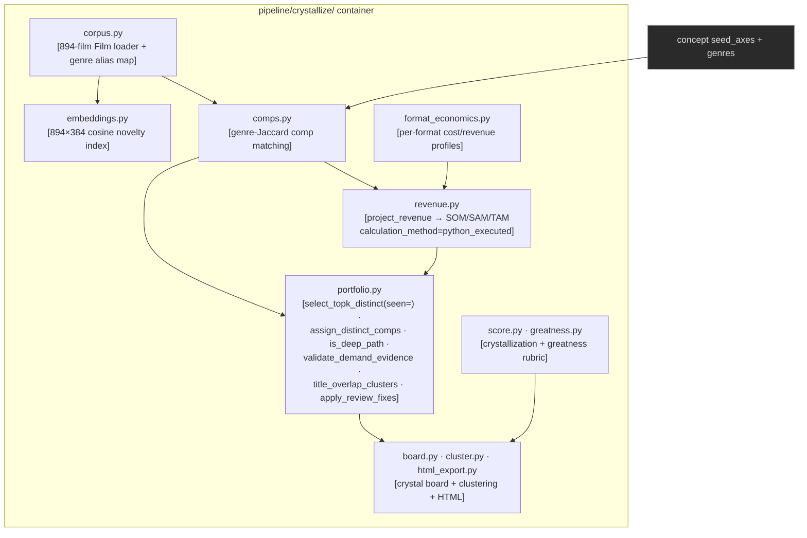

# C3 — Component Diagrams

> [!abstract] Level 3 answers
> *What are the major components inside the two highest-complexity containers —
> `pipeline/` and `pipeline/crystallize/` — and how do they collaborate?*
> Class/function detail is [[04-c4-code-paths|C4]].

## C3.1 — Inside `pipeline/` (orchestration + LLM-free logic)

```mermaid
flowchart TB
    subgraph pipeline ["pipeline/ container"]
        direction TB
        subgraph orch ["Orchestration"]
            rsi["run_single_idea.py<br/>single_idea.py<br/>[10-phase driver + phase→agent map]"]
            lw["loop_wedge.py<br/>[WEDGE autonomous loop]"]
            run["run.py / run_cc.py<br/>[batch entry points]"]
        end
        subgraph gen ["Generation"]
            cs["compound_seed.py<br/>seed_engine.py · seed_moa.py · seed_picker.py"]
            div["diversity.py<br/>[freq table + α=0.8 penalty]"]
            zg["zeitgeist_probe.py<br/>[24h cultural-moment cache]"]
        end
        subgraph score ["Scoring (the only arithmetic)"]
            sc["scoring.py<br/>[SDT + AJTBD + overall]"]
            eg["empirical_genius.py<br/>[embedding novelty C001–C008]"]
            scard["scorecard.py · score_postprocess.py"]
        end
        subgraph gate ["Gating"]
            lc["loop_controller.py<br/>[plateau + L1–L5 budgets]"]
            eval["eval_gate.py · evaluate_draft_quality.py"]
            tf["template_filter.py<br/>[strip_internal_ids]"]
            cons["consistency.py · evidence_gate.py · commercial_prescreen.py"]
        end
        subgraph disp ["Dispatch & quota"]
            cc["cc_dispatch.py<br/>[Claude Task fan-out]"]
            q["quota.py<br/>[weekly Opus burn gate]"]
            km["key_manager.py<br/>[3-key rotation + masking]"]
            llm["llm_client.py · openrouter_client.py<br/>research/client_302ai.py"]
        end
        subgraph statec ["State & learning"]
            st["state.py<br/>[safe_write JSONL]"]
            lb["leaderboard.py<br/>[cross-run + mode-collapse alarm]"]
            goal["goal.py · feedback.py · labels.py<br/>[learned weights + refit]"]
            pc["plan_compliance.py<br/>[pre/post-task gate]"]
        end
        subgraph render ["Rendering & research"]
            rd["research_dispatch.py · sonar_cache.py"]
            html["export_html.py · index_html.py"]
            qr["quality_report.py · digest.py · phase_timing.py"]
        end
    end
    cryst["crystallize/ → C3.2"]:::ext

    rsi --> cs --> div
    rsi --> sc --> eg
    rsi --> lc
    rsi --> tf
    rsi --> cc --> q --> km
    cc --> llm
    rsi --> st
    lw --> goal
    lw --> lb
    sc --> cryst
    rsi --> rd --> sonar_cache_note["(24h cache)"]
    classDef ext fill:#2a2a2a,stroke:#888,color:#ddd;
```

> [!warning] Hard import boundaries (lint-enforced)
> - `scoring.py`, `cc_dispatch.py` **MUST NOT** import `anthropic` / `httpx` /
>   `openrouter_client` — **ANOMALY-001**.
> - No `pipeline/**` module imports `frameworks/` — **ANOMALY-002**.
> - `total_score` is `None` until `scoring.py` runs — LLMs never populate it.
> - `pipeline/gemini_dispatch.py` is **forward-compat scaffolding** — a planned second
>   dispatch shim referenced by `lint_imports.py` (which `continue`s past absent targets)
>   and CLAUDE.md. Only `cc_dispatch.py` exists today; the lint rule handles its absence.

## C3.2 — Inside `pipeline/crystallize/` (economics + corpus + portfolio)

## Component responsibilities (selected)

> [!info] Naming convention: each module is a noun with one responsibility
| Component | Responsibility | ADR |
|---|---|---|
| `state.py` | `safe_write` (atomic), JSONL append, handoff/checkpoint | 0001 |
| `scoring.py` | SDT + AJTBD + overall score — the only arithmetic | 0002, 0005 |
| `loop_controller.py` | `plateau_reached`, `patch_budget` (L1=3, L2=5, L3=3, L4=3, L5=2) | 0009 |
| `diversity.py` | axis-value frequency table + soft penalty (α=0.8, ≤40%/20 runs) | 0012 |
| `cc_dispatch.py` | pure-Python Claude Task fan-out manifests (no LLM client import) | 0007 |
| `quota.py` | weekly subscription burn gate for Opus promotion | 0008 |
| `key_manager.py` | 3-key rotation + first-8-char secret masking | 0003 |
| `template_filter.py` | `strip_internal_ids`, SOM-line canon, translation-friendliness | 0010 |
| `crystallize/revenue.py` | corpus-anchored SOM/SAM/TAM (`project_revenue`) | 0011 |
| `crystallize/portfolio.py` | cross-slate **`seen=`** distinct selection + demand-evidence validators | 0005 |
| `empirical_genius.py` | embedding-novelty + originality kill-switches (C001–C008) | 0002 |

> [!note] Subpackages
> `pipeline/axes/` (axis prose resolvers), `pipeline/evolve/` (`one_shot` generation),
> `pipeline/operators/`, `pipeline/research/` (`client_302ai`), `pipeline/select/`.

## Out of scope at C3
- How a request flows through these components over time → [[04-c4-code-paths]]

## Related
- [[_index|Architecture MOC]] · [[02-c2-containers]] · [[04-c4-code-paths]] · [[05-adr-registry]]
