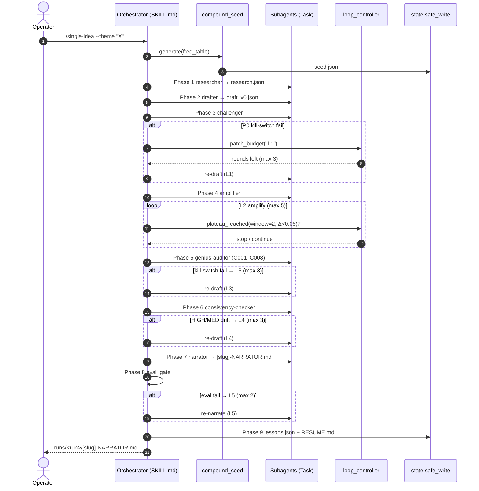
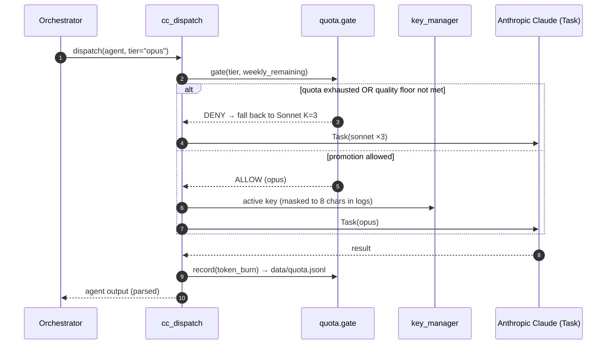
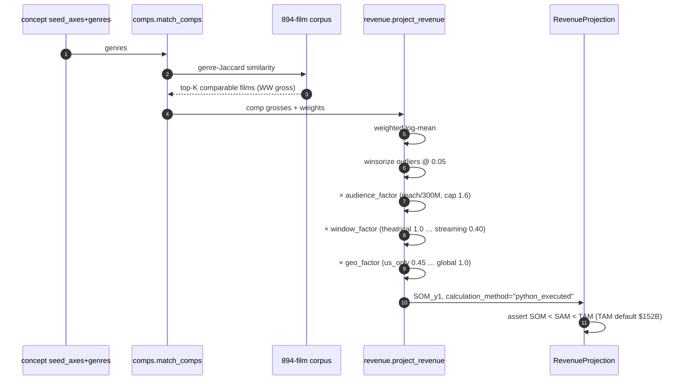
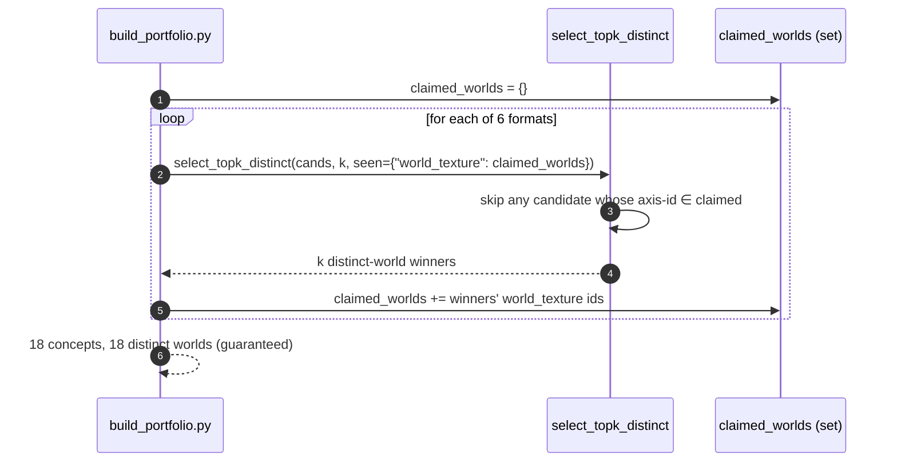

# C4 — Critical Code Paths

> [!abstract] Level 4 answers
> *How do the highest-risk paths actually execute over time?* Only the **5 paths**
> with the most coordination, gating, or anti-hallucination risk get a sequence
> diagram — not every function.

---

## C4.1 — Single-Idea pipeline (10 phases + L1–L5 loops)

> [!example] Risk: recursive patch loops must be **Python-bounded**, never LLM-decided.



> [!important] All loop caps live in `loop_controller.py` ([[05-adr-registry|ADR-0009]])
> `L1=3, L2=5, L3=3, L4=3, L5=2`. Plateau = last 2 relative deltas both `< 0.05`.

---

## C4.2 — Model dispatch + Opus quota gate

> [!example] Risk: Opus is rate/cost limited; promotion must be **quota-gated**, and the
> dispatcher must never import an LLM client ([[05-adr-registry|ADR-0002/0007/0008]]).



> [!warning] Enforcers
> `cc_dispatch.py` is lint-blocked from importing `anthropic`/`httpx`/`openrouter_client`
> (ANOMALY-001). Every Task burn is recorded via `pipeline.quota.record`.

---

## C4.3 — Revenue projection (SOM / SAM / TAM)

> [!example] Risk: the #1 fabrication surface. Every number must be python-executed
> ([[05-adr-registry|ADR-0011]]); LLMs may never restate a financial figure.



> [!important] The gate
> `evals/test_revenue_projection.py` asserts `calculation_method == "python_executed"`
> and the SOM<SAM<TAM ordering; any concept failing the invariant is quarantined, not shipped.

---

## C4.4 — Cross-slate distinct selection (the v5.2.1 fix)

> [!example] Risk: look-alike concepts across formats. Distinctness must hold across the
> **whole slate**, not just within a format.



> [!note] Regression gate
> `evals/test_portfolio_distinctiveness.py` asserts token-distinct titles, logline
> Jaccard ≤ 0.50, and ≥3 deep-linked comps per concept. Two unit tests pin the
> `seen=` exclusion and its caller-set immutability.

---

## C4.5 — WEDGE autonomous loop

> [!example] Risk: an unattended loop must self-halt and learn only from operator ratings,
> never from its own scores ([[05-adr-registry|ADR-0009/0012]]).

```mermaid
sequenceDiagram
    autonumber
    participant Loop as loop_wedge
    participant Q as quota.gate
    participant Gen as evolve.one_shot
    participant Score as scoring (vs Goal)
    participant Hist as loop_history.jsonl
    participant FB as feedback.refit_weights

    loop until score≥target AND som≥floor
        Loop->>Q: gate(opus weekly quota)
        Q-->>Loop: ok / fall back
        Loop->>Gen: one_shot(freq_table + diversity)
        Gen-->>Loop: candidate
        Loop->>Score: geometric-mean facets
        Score->>Hist: append iteration
        Loop->>Loop: plateau_reached?
        alt plateau AND operator ratings exist
            Loop->>FB: refit_weights(labels) → Goal.save(new id)
        end
    end
    Loop-->>Loop: halt
```

## Related
- [[_index|Architecture MOC]] · [[03-c3-components]] · [[05-adr-registry]] · [[06-glossary]]
