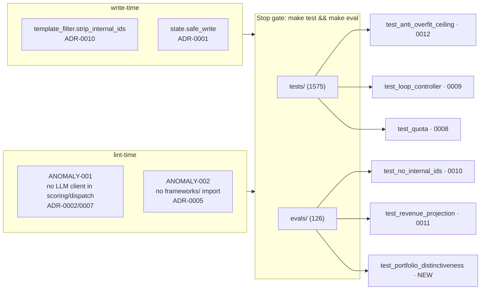

# ADR Registry & Enforcement

> [!abstract] Every rule has a mechanical enforcer
> `CLAUDE.md` states the operating contract as MUST / MUST NOT lines. Each one is
> backed by a test, a lint rule, or a hook — *"if a rule has no enforcer, it does
> not exist."* This page maps the 12 ADRs to what enforces them.

## Registry

| ADR | Title | Mechanical enforcer |
|---|---|---|
| **0001** | State on disk as JSONL, not agent memory | `tests/test_state.py::test_atomic_write_under_kill` |
| **0002** | LLMs do no arithmetic | ANOMALY-001 lint + `tests/test_scoring.py` |
| **0003** | 3-key rotation + secret masking (first 8 chars) | `tests/test_log_masking.py`, `tests/test_secret_leak.py` |
| **0004** | Canonical data immutable downstream | `tests/test_audit_concepts.py` |
| **0005** | `frameworks/` read-only | ANOMALY-002 (`scripts/lint_imports.py`) |
| **0006** | Opus promotion (superseded by 0008) | — |
| **0007** | Pure-CC Task dispatch replaces OpenRouter | `tests/test_cc_dispatch.py` |
| **0008** | Opus promotion gated by weekly quota | `tests/test_quota.py` |
| **0009** | Single-idea recursive loops L1–L5 | `tests/test_loop_controller.py` |
| **0010** | No internal IDs in investor docs | `evals/test_no_internal_ids.py` |
| **0011** | Data-driven revenue (python-executed) | `evals/test_revenue_projection.py` |
| **0012** | Anti-overfit sampling (≤40% / axis-value / 20 runs) | `tests/test_anti_overfit_ceiling.py` |

## Enforcement map

> [!important] The Stop gate
> No session is "done" until `make test && make eval` both pass **and** `RESUME.md`'s
> mtime is newer than the most recent `data/run_log.jsonl` event. The Stop hook blocks
> on a stale `RESUME.md`.

## Secrets & safety (ADR-0003 + harness gates)

> [!warning] Hard prohibitions (hook-enforced)
> - No secret prefixes (`sk-or-v1-`, `sk-ant-`, `ghp_`) committed outside `.env.example`.
> - `gitleaks` runs at **pre-commit** (staged) and must run before any push.
> - Agents may not `git commit --no-verify` or `git push --force` to main.
> - Protected files (agents may not edit): `pyproject.toml`, `lefthook.yml`,
>   `.claude/settings.json`, `Makefile`, `uv.lock`.
> - `scripts/set_env_key.py` is the only sanctioned `.env` writer and stays **untracked**.

## Related
- [[_index|Architecture MOC]] · [[03-c3-components]] · [[04-c4-code-paths]]
- Source of truth: [`CLAUDE.md`](../../CLAUDE.md)
