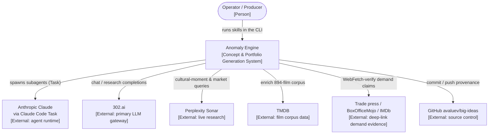
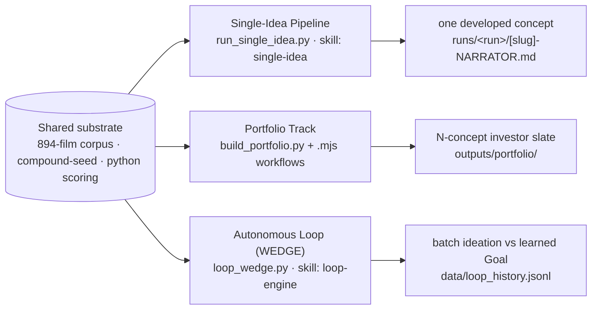

# 🗺️ Anomaly Engine — Architecture Map of Content

> [!abstract] What this is
> The **Anomaly Engine** (`pyproject` name `anomaly-engine`) turns a *problem + themes*
> into investor-grade, evidence-backed screen-property concepts and diversified
> portfolios. Every financial number is **computed in Python — never by a language
> model** — and every demand claim traces to a **deep-link source that returns 2xx**.
>
> This vault documents the system with the **[C4 model](https://c4model.com)**:
> four levels of zoom, from a one-page context diagram down to the highest-risk code paths.

## How to read this vault

> [!tip] Start at C1 and descend only as far as you need
> Most readers need **[[01-c1-system-context|C1]]** + **[[02-c2-containers|C2]]**.
> Developers extending a subsystem read **[[03-c3-components|C3]]**.
> The **[[04-c4-code-paths|C4]]** sequence diagrams are for the 5 highest-risk paths only.

| Level | Note | Question it answers | Audience |
|---|---|---|---|
| **C1** | [[01-c1-system-context]] | What does the engine do, who uses it, what does it talk to? | Everyone |
| **C2** | [[02-c2-containers]] | What are the runtime units & stores, and how do they communicate? | Architects |
| **C3** | [[03-c3-components]] | What are the components inside `pipeline/` and `crystallize/`? | Developers |
| **C4** | [[04-c4-code-paths]] | How do the 5 highest-risk code paths actually work? | Developers |
| — | [[05-adr-registry]] | Which decisions are load-bearing, and what enforces them? | Architects |
| — | [[06-glossary]] | What does each term mean? | Everyone |

## The system in one diagram

## Three production tracks over one substrate

> [!info] One corpus, three entry points
> All three tracks share the **894-film corpus**, the **compound-seed engine**
> (~19.2 trillion narrative-axis combinations), and the **pure-Python scoring layer**.

## Core invariants (the ADRs in one breath)

> [!important] Five rules that everything else protects
> - **State lives on disk** as JSONL, written atomically — never in agent context. ^adr1
> - **LLMs do no arithmetic.** Every score / SOM is python-executed. ^adr2
> - **Frameworks are read-only**; no `pipeline/**` module imports `frameworks/`. ^adr5
> - **Investor output carries no internal IDs** or framework labels. ^adr10
> - **Every demand claim is a deep-link** that resolves (2xx). ^evidence
>
> Full table with enforcers → [[05-adr-registry]].

## Related

- Linear engineering reference: [`docs/SOLUTION_ARCHITECTURE.md`](../SOLUTION_ARCHITECTURE.md)
- Operating contract: [`CLAUDE.md`](../../CLAUDE.md)
- Recovery / session state: [`.planning/state/RESUME.md`](../../.planning/state/RESUME.md)
